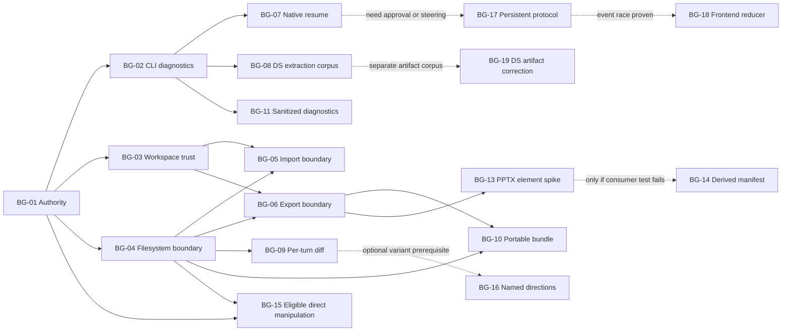

# BurnGuard Design 경쟁 설계 조사와 개발 방향

> 조사 기준일: 2026-08-13
> 상태: 승인 전 개발계획 제안
> 산출물: Markdown 상세 보고서 + 독립 실행형 HTML 요약 브리프
> 원칙: 외부 구현을 복사하지 않고, 검증된 제품·아키텍처 패턴을 BurnGuard의 로컬 우선 경계 안에서 다시 설계한다.

## 1. 결론

BurnGuard는 이미 “Claude Design의 빈 껍데기”가 아니다. 현재 코드에는 채팅+iframe 캔버스, 요소 선택, 인라인 편집, CSS 조정, 댓글, 드로잉, 프레젠테이션, 디자인 시스템 추출, 파일 감시, 턴별 체크포인트, PDF/PPTX/HTML/handoff export가 구현되어 있다. 다만 핵심 경험은 여러 얇은 기능이 아니라 **안전한 로컬 권한 경계, 연속적인 대화 상태, 변경 내용을 이해하고 되돌리는 흐름, 직접 조작 가능한 구조화된 결과물, 디자인 시스템 검증**에서 갈린다. 현재 가장 큰 제약은 인증 없는 localhost API, 매 턴 새로운 CLI 프로세스, `ProjectView.tsx`의 과도한 책임, 그리고 텍스트 박스와 배경색 중심의 PPTX exporter다. [BurnGuard `server.ts`](../../../packages/backend/src/server.ts), [BurnGuard `turns.ts`](../../../packages/backend/src/services/turns.ts), [Claude runner](../../../packages/backend/src/adapters/claude-code/runner.ts), [ProjectView](../../../packages/frontend/src/views/ProjectView.tsx), [PPTX exporter](../../../packages/backend/src/services/export-pptx.ts)

BurnGuard의 정확한 제품 경계는 “파일이 절대 외부로 나가지 않는다”가 아니다. **workspace와 system of record는 로컬에 남고, 모델에 제공되는 문맥은 사용자가 선택한 CLI와 provider 정책에 따라 처리된다.** 이 정의는 authenticated CLI 실행과 외부 GitHub·웹·Figma ingestion을 모두 포괄한다. [`README.md`](../../../README.md), [`runner.ts`](../../../packages/backend/src/adapters/claude-code/runner.ts), [`design-system-extract.ts`](../../../packages/backend/src/services/design-system-extract.ts)

Claude Design에서 가져와야 할 핵심은 외형이 아니라 다음의 작업 루프다.

1. 대화로 첫 결과를 만든다.
2. 특정 요소에는 댓글, 빠른 수정에는 직접 편집, 구조 변화에는 채팅을 사용한다.
3. 여러 방향을 안전하게 탐색하고 이전 상태를 비교·복구한다.
4. 디자인 시스템을 적용하는 데서 끝나지 않고 결과를 검증하고 위반을 수정한다.
5. 결과물을 코드·PPTX·PDF·HTML 등 다른 도구로 넘길 때 손실 범위를 통제한다.

1~4는 Claude Design 공식 문서에서 확인한 제품 흐름이고, 5의 손실 통제는 BurnGuard가 도출한 handoff 원칙이다. [Claude Design 시작 가이드](https://support.claude.com/en/articles/14604416-get-started-with-claude-design), [Anthropic 발표문](https://www.anthropic.com/news/claude-design-anthropic-labs), [Claude Design 제품 페이지](https://claude.com/product/design)

현재 상태를 설명할 때는 2026-04-17 발표문의 “research preview”가 아니라 2026-08-13 제품·도움말의 **beta**를 기준으로 삼아야 한다. 현재 사용량은 Chat·Cowork·Claude Code와 공유되고, 공식 connector는 Adobe·Base44·Canva·Gamma·Lovable·Miro·Replit·Vercel·Wix까지 확장됐다. 발표문에만 있는 “Opus 4.7”은 현재 페이지가 반복하지 않으므로 현재 런타임 사실로 취급하지 않는다. [Claude Design 제품 페이지](https://claude.com/product/design), [Claude Design 시작 가이드](https://support.claude.com/en/articles/14604416-get-started-with-claude-design), [Anthropic 발표문](https://www.anthropic.com/news/claude-design-anthropic-labs)

따라서 다음 개발 주기는 기능을 많이 붙이는 방향보다 아래 다섯 개의 기반을 먼저 강화해야 한다.

- **로컬 권한 경계**: 고정 loopback 포트의 모든 mutating API에 per-launch capability와 strict Host/Origin/CSRF 검증을 적용한다.
- **세션 연속성**: CLI resume 식별자를 저장하고 재시작 후 복구를 검증한다.
- **변경 가시성**: 현재 체크포인트를 사용자에게 보이는 턴별 diff·복구 표면으로 연결한다.
- **구조화된 결과물**: 프로토타입/덱 요소에 안정적인 기계 판독 계약을 부여하고 직접 조작과 export가 같은 계약을 사용하게 한다.
- **디자인 시스템 추출 증거**: 추출된 토큰을 보관하는 데 그치지 않고 source provenance, 누락, 모호성, 대체를 gold corpus로 검증한다. Artifact 위반 검사는 그 이후의 별도 과제다.

## 2. BurnGuard 현재 상태

### 2.1 이미 가진 강점

| 영역 | 현재 구현 | 근거 |
|---|---|---|
| 로컬 런타임 | 설치된 `claude`/`codex` CLI를 Bun child process로 실행 | [`README.md`](../../../README.md), [`adapters/registry.ts`](../../../packages/backend/src/adapters/registry.ts) |
| 채팅·스트리밍 | 이벤트를 SQLite에 저장하고 in-memory broker와 SSE로 전달 | [`routes/session.ts`](../../../packages/backend/src/routes/session.ts), [`services/broker.ts`](../../../packages/backend/src/services/broker.ts), [`db/events.ts`](../../../packages/backend/src/db/events.ts) |
| 캔버스 | sandboxed iframe 위에 Select, Comment, Edit, Tweaks, Draw 레이어 제공 | [`Canvas.tsx`](../../../packages/frontend/src/components/canvas/Canvas.tsx), [`ProjectView.tsx`](../../../packages/frontend/src/views/ProjectView.tsx) |
| 요소 식별 | `data-bg-node-id`와 frame bridge를 사용해 iframe 요소를 선택·수정 | [`frame-bridge.ts`](../../../packages/frontend/src/components/canvas/frame-bridge.ts), [`file-patch.ts`](../../../packages/backend/src/services/file-patch.ts) |
| 디자인 시스템 | GitHub·웹사이트·Figma·PDF·PPTX에서 색·타이포·컴포넌트 샘플 추출 | [`design-system-extract.ts`](../../../packages/backend/src/services/design-system-extract.ts), [`figma.ts`](../../../packages/backend/src/services/figma.ts) |
| 복구 | 턴 시작 전 파일 트리를 복사하고 특정 턴 스냅샷 복원 | [`checkpoints.ts`](../../../packages/backend/src/services/checkpoints.ts) |
| Export | HTML ZIP, PDF, PPTX, handoff bundle | [`exports.ts`](../../../packages/backend/src/services/exports.ts) |
| 테스트 | parser, checkpoint, export, patch, extraction 등 backend 테스트 보유 | [`packages/backend/tests`](../../../packages/backend/tests) |

### 2.2 현재 병목

#### A. loopback API가 로컬 권한을 과도하게 신뢰한다

Backend는 `127.0.0.1`에 bind하지만 예측 가능한 기본 포트 `14070`을 사용하고, 모든 route를 인증·Origin·Host 검증 middleware 없이 mount한다. 이 표면에는 프로젝트 삭제, 파일 patch, CLI turn 시작, 도구 설치와 URL/file ingestion 같은 mutating API가 포함된다. loopback bind는 LAN 접근을 막지만 악성 웹페이지나 다른 로컬 프로세스의 요청을 권한 있는 BurnGuard UI 요청과 구분하지 못한다. 따라서 경쟁 기능보다 먼저 per-launch high-entropy capability, strict Host/Origin allowlist, non-simple custom header 또는 동등한 CSRF 방어를 넣어야 한다. CORS만으로 해결된다고 간주하면 안 된다. [`index.ts`](../../../packages/backend/src/index.ts), [`server.ts`](../../../packages/backend/src/server.ts), [`project.ts`](../../../packages/backend/src/routes/project.ts), [`settings.ts`](../../../packages/backend/src/routes/settings.ts), [OWASP CSRF Prevention Cheat Sheet](https://cheatsheetseries.owasp.org/cheatsheets/Cross-Site_Request_Forgery_Prevention_Cheat_Sheet.html)

#### B. 대화 연속성이 파일 시스템에 의존한다

Claude adapter는 매 턴 `claude -p --output-format stream-json`을 새로 실행한다. 프롬프트 빌더는 디자인 시스템, 파일 목록, 첨부물과 현재 사용자 메시지를 조립하지만 전체 대화 기록을 직접 넣지 않는다. 반면 DB에는 사용되지 않는 `backend_session_state`와 `pid`, shared contract에는 `resumeBySessionId`가 이미 있다. 먼저 이 기존 seam을 활성화하는 것이 새 런타임을 만드는 것보다 작고 검증 가능하다. [`runner.ts`](../../../packages/backend/src/adapters/claude-code/runner.ts), [`prompt-builder.ts`](../../../packages/backend/src/harness/prompt-builder.ts), [`schema.ts`](../../../packages/backend/src/db/schema.ts), [`harness.ts`](../../../packages/shared/src/harness.ts)

2026-08-13 기준 이 작업 환경에서 `claude 2.1.229 --help`는 `--resume`, `--fork-session`, `--session-id`, stream-json input/output을 제공했다. 반면 `codex-cli 0.145.0`의 `-p`는 print가 아니라 `--profile`이며 비대화형 실행은 `codex exec`다. 현재 BurnGuard의 `codex -p <prompt>` 호출은 설치된 CLI 계약과 맞지 않으므로, session parity보다 먼저 backend별 실제 invocation probe가 필요하다. [`codex/index.ts`](../../../packages/backend/src/adapters/codex/index.ts)

#### C. 프론트엔드의 책임이 한 컴포넌트에 몰려 있다

`ProjectView.tsx`는 프로젝트 query, SSE replay, 세션 상태, 권한 요청, 탭, 다섯 편집 모드, undo/redo, draw, presentation을 함께 조정한다. 이 상태에서 이벤트 종류를 늘리면 세션 런타임 변경이 캔버스 UI까지 번질 가능성이 높다. 다만 “큰 파일이므로 리팩터링”하지 않고, 세션 resume 또는 권한 왕복을 구현할 때 실제로 필요한 상태 전이만 reducer/store로 추출해야 한다. [`ProjectView.tsx`](../../../packages/frontend/src/views/ProjectView.tsx), [`api/session.ts`](../../../packages/frontend/src/api/session.ts)

#### D. 체크포인트가 사용자 가치로 노출되지 않는다

전체 파일 복사와 복원은 구현되어 있지만, 사용자가 “이번 턴에 무엇이 바뀌었는지”를 보고 일부 변경을 이해하는 표면은 없다. bolt.diy는 diff view와 revert를 핵심 기능으로 명시하며, Claude Design은 다른 방향을 저장한 뒤 이전 결과를 참조하는 흐름을 안내한다. BurnGuard는 이미 체크포인트라는 선행 자산이 있으므로 read-only diff부터 얇게 연결할 수 있다. [`checkpoints.ts`](../../../packages/backend/src/services/checkpoints.ts), [bolt.diy README @ `2e254ac`](https://github.com/stackblitz-labs/bolt.diy/blob/2e254ac19a696394030601bc602f54945b12bfc4/README.md), [Claude Design 시작 가이드](https://support.claude.com/en/articles/14604416-get-started-with-claude-design)

#### E. PPTX export의 표현 범위가 좁다

BurnGuard exporter는 브라우저 레이아웃을 읽어 text box와 배경색을 PptxGenJS로 만든다. 이미지·shape·table·chart·rich-text run을 동일한 수준으로 복원하지 않는다. PPTist는 텍스트·이미지·shape·line·chart·table·video·audio·formula를 갖는 구조화된 slide editor를 제공하지만 AGPL-3.0이므로 구현 코드를 가져오면 안 된다. 반대로 MIT 계열의 export 연구는 참고할 수 있어도, 채택 기준은 라이선스가 아니라 PowerPoint/LibreOffice fixture 호환성이다. [`export-pptx.ts`](../../../packages/backend/src/services/export-pptx.ts), [PPTist README @ `2bfd88f`](https://github.com/pipipi-pikachu/PPTist/blob/2bfd88fef0d721b24b3a97bd5e3c8a36cabff0c6/README.md)

#### F. 문서가 구현보다 뒤처져 있다

`doc/00-overview.md`와 `doc/01-architecture.md`에는 댓글·편집·권한·export·테스트의 일부가 미구현인 것처럼 남아 있지만 실제 코드와 테스트에는 구현이 존재한다. 다음 구현 계획에는 문서 정합성 검사가 각 기능의 완료 조건으로 포함되어야 한다. [`doc/00-overview.md`](../../../doc/00-overview.md), [`doc/01-architecture.md`](../../../doc/01-architecture.md), [`packages/backend/tests`](../../../packages/backend/tests)

## 3. Claude Design에서 가져올 설계

2026-08-13 실페이지 재검증에서 제품 페이지·발표문·시작 가이드·디자인 시스템 가이드·Artifacts 가이드가 모두 직접 원본으로 열렸다. 현재 제품과 도움말은 beta, 공유 사용량, 아홉 connector, `/design-sync`·`/design`·MCP, drag/resize/align, Enterprise 디자인 시스템 관리 권한을 설명한다. 반면 2026-04-17 발표문은 출시 당시 기록으로만 사용한다. 실제 인증 제품과 MCP 도구 계약은 실행하지 않았으므로 export 신뢰성이나 동기화 fidelity는 공식 주장이지 실행 검증 결과가 아니다. [실페이지 관찰 기록](../../recon/LIVE-RECON.md)

### 3.1 공식 기능 지도

| Claude Design 설계 | 공식 근거 | BurnGuard 상태 | 판단 |
|---|---|---|---|
| 채팅 왼쪽 + 캔버스 오른쪽 | [시작 가이드](https://support.claude.com/en/articles/14604416-get-started-with-claude-design) | 구현됨 | 유지 |
| 채팅·인라인 댓글·직접 편집의 역할 분리 | [시작 가이드](https://support.claude.com/en/articles/14604416-get-started-with-claude-design) | 세 모드 모두 존재 | 역할 안내·상태 안정성 강화 |
| drag·resize·align과 adjustment controls | [제품 페이지](https://claude.com/product/design), [발표문](https://www.anthropic.com/news/claude-design-anthropic-labs) | style tweak은 있으나 공간 직접 조작은 제한적 | 단일 artifact vertical slice로 실험 |
| 여러 디자인 방향 생성·선택 | [제품 페이지](https://claude.com/product/design) | 명시적 direction model 없음 | 버전/diff 기반 위에 추가 |
| 기존 방향 저장과 revision | [시작 가이드](https://support.claude.com/en/articles/14604416-get-started-with-claude-design) | snapshot restore는 있음 | diff → named direction 순서 |
| design system 추출·검토·publish | [설정 가이드](https://support.claude.com/en/articles/14604397-set-up-your-design-system-in-claude-design) | 추출·상태 workflow 존재 | validation report 우선 |
| GitHub·local codebase·문서 import | [제품 페이지](https://claude.com/product/design) | GitHub/website/Figma/PDF/PPTX 구현 | provenance·진단 강화 |
| Claude Code sync와 handoff | [시작 가이드](https://support.claude.com/en/articles/14604416-get-started-with-claude-design) | handoff ZIP 존재 | portable bundle 우선; MCP는 첫 계획 범위 밖 |
| PDF·PPTX·HTML export | [발표문](https://www.anthropic.com/news/claude-design-anthropic-labs) | 구현됨 | 품질·호환성 강화 |
| 조직 공유·공동 편집 | [발표문](https://www.anthropic.com/news/claude-design-anthropic-labs) | 없음 | 로컬 단일 사용자 경계상 비목표 |

### 3.2 현재 제품에서 확인된 제약

- 제품은 beta이며 실제 앱은 유료 plan 인증을 요구한다.
- 도움말은 대형 codebase에서 지연이나 browser 문제가 발생할 수 있고 inline comment와 동시 편집이 아직 안정적이지 않다고 밝힌다.
- 관리자 가이드는 Enterprise rollout에서 디자인 시스템을 먼저 확정한 뒤 접근 범위를 단계적으로 넓히도록 권장한다.
- 관리자 가이드는 Preview를 별도 content domain의 sandboxed iframe과 짧은 수명의 signed token으로 격리한다고 설명한다. 확인한 공식 문서에서는 별도의 audit log 기능을 찾지 못했다.

[Claude Design 시작 가이드](https://support.claude.com/en/articles/14604416-get-started-with-claude-design), [Claude Design 관리자 가이드](https://support.claude.com/en/articles/14604406-claude-design-admin-guide-for-team-and-enterprise-plans)

### 3.3 가져오지 않을 것

- Claude Design의 조직 공유, 조직 RBAC, cloud link 권한 모델은 BurnGuard의 로컬 단일 사용자 정체성과 맞지 않는다. [BurnGuard README](../../../README.md), [Claude Design 발표문](https://www.anthropic.com/news/claude-design-anthropic-labs)
- Claude Artifacts의 public hosting, shared persistent storage, 사용량 과금 모델은 별도 제품 영역이며 BurnGuard의 현재 목표가 아니다. [Claude Artifacts 도움말](https://support.claude.com/en/articles/9487310-what-are-artifacts-and-how-do-i-use-them)
- Opus 4.7 또는 특정 모델에 종속되는 품질 전략은 `claude`/`codex` CLI 재사용이라는 BurnGuard 경계를 약화한다. [Anthropic 발표문](https://www.anthropic.com/news/claude-design-anthropic-labs), [BurnGuard README](../../../README.md)

## 4. 유사 저장소에서 가져올 설계

### 4.1 직접 경쟁군

#### Open Design

Open Design은 2026년 현재 BurnGuard와 가장 직접적으로 겹친다. 로컬 coding-agent CLI, iframe preview, design system, skills/templates/plugins, MCP, prototype/deck/image/video 산출물을 한 workspace에 묶는다. 특히 **skill·rendering template·design system을 별도 portable package로 구분**하고, 외부 agent가 live file을 읽도록 MCP를 제공하는 설계는 참고 가치가 높다. 반면 100+ skills, 277 official plugins, marketplace, 25개 CLI 지원은 BurnGuard가 지금 따라갈 범위가 아니다. [Open Design README @ `85d2e48`](https://github.com/nexu-io/open-design/blob/85d2e4893c138dc3bb6ea5941b2ec13f4a37658e/README.md)

가져올 것:

- 내장 skill의 독립 배포 가능성
- design system과 render template의 분리
- 외부 agent가 프로젝트의 최신 파일을 읽는 read-only MCP
- artifact bundle의 versioned manifest

보류할 것:

- marketplace와 대규모 plugin catalog
- 수십 개 runtime adapter
- 이미지·비디오·오디오 생성 제품군

#### Onlook

Onlook은 iframe의 DOM을 읽고 visual edit를 코드에 반영하는 루프를 제품의 핵심으로 설명한다. BurnGuard는 이미 iframe bridge와 `data-bg-node-id`를 갖고 있으므로, Onlook 전체 editor를 도입하는 대신 **공간 속성의 최소 patch contract**를 기존 요소 식별 계약에 추가하는 접근이 적합하다. Onlook은 Next.js+Tailwind를 전제로 하지만 BurnGuard artifact는 일반 HTML/CSS이므로 framework-specific AST sync는 따라가면 안 된다. [Onlook README @ `423e2e9`](https://github.com/onlook-dev/onlook/blob/423e2e924366419e418ee049093872d535eea41a/README.md)

#### Dyad와 bolt.diy

Dyad의 유효한 교훈은 로컬·cross-platform·no-lock-in 포지셔닝과 OSS/pro 경계의 명시다. bolt.diy에서 가져올 것은 19개 provider가 아니라 **diff, revert, file locking, desktop 진단**이다. BurnGuard는 API key manager가 아니라 설치된 CLI adapter를 제품 경계로 유지해야 한다. [Dyad README @ `f1e0335`](https://github.com/dyad-sh/dyad/blob/f1e03352b67f75a1898202df8de29d597c66653f/README.md), [bolt.diy README @ `2e254ac`](https://github.com/stackblitz-labs/bolt.diy/blob/2e254ac19a696394030601bc602f54945b12bfc4/README.md)

코드 검증은 하나의 보편적 “수렴 루프”가 아니라 서로 보완적인 두 설계 lane을 보여줬다. BurnGuard의 **설계 가설**은 visual targeting(`stable identity → typed bridge → transaction`)과 change control(`mutation lock → change set/diff → restore/version`)을 change-set ID로 연결하는 것이다. Onlook의 JSX OID repair나 Dyad의 tag-protocol/git 설계가 BurnGuard plain HTML·native CLI에 그대로 맞는다는 증거는 아니다. 먼저 node-ID integrity validator가 duplicate/missing/empty/changed ID를 탐지해 fail-closed해야 하며, 자동 repair는 comment·selection·undo·restore 안정성 fixture 뒤에만 검토한다.

현재 checkpoint는 eligible tree를 매 턴 복사하므로 성장량은 구조적으로 선형이지만 실제 disk/latency는 측정하지 않았다. Git은 replacement 결정이 아니라 bounded retention/GC, content-addressed delta와 함께 benchmark할 후보일 뿐이다. Dyad는 `src/pro/` 밖은 Apache-2.0, 안은 FSL-1.1-ALv2인 mixed-license 프로젝트이므로 현재 경쟁 제품 작업에서 `src/pro/`는 donor로 사용하지 않는다. bolt.diy 자체는 MIT지만 기본 WebContainer API는 영리 목적 production에 별도 상용 계약이 필요하고 POC는 예외다. WebContainer와 cloud sandbox는 라이선스 이전에 BurnGuard의 installed-CLI/local-files 경계와 충돌하므로, BurnGuard는 cloud sandbox와 model tag protocol을 채택하지 않는다. [Onlook @ `423e2e9`](https://github.com/onlook-dev/onlook/tree/423e2e924366419e418ee049093872d535eea41a), [Dyad @ `f1e0335`](https://github.com/dyad-sh/dyad/tree/f1e03352b67f75a1898202df8de29d597c66653f), [bolt.diy @ `2e254ac`](https://github.com/stackblitz-labs/bolt.diy/tree/2e254ac19a696394030601bc602f54945b12bfc4), [WebContainer 상용 라이선스](https://webcontainers.io/enterprise)

### 4.2 캔버스·디자인 시스템군

| 저장소 | 유효한 설계 | BurnGuard 판단 |
|---|---|---|
| [Penpot @ `af1537d`](https://github.com/penpot/penpot/tree/af1537d071d776d8ef4c512acfcab4bf1ee01f9c) | design token·component·variant·open API를 같은 design system으로 묶음 | MPL-2.0 file-level copyleft; behavior·contract 참고, code는 path별 검토 |
| [Plasmic @ `0c34d32`](https://github.com/plasmicapp/plasmic/tree/0c34d325da1181fd057fdb18345d153d99fd0c92) | 코드 컴포넌트를 등록해 visual builder의 guardrail로 사용 | 장기적으로 component registry 참고, bidirectional React codegen은 제외 |
| [GrapesJS @ `ad4b5c1`](https://github.com/GrapesJS/grapesjs/tree/ad4b5c1e361b2280397236aab006cd3002b5f524) | HTML component/style/storage/command를 분리한 embeddable editor | core BSD-3-Clause·root LICENSE pointer; per-path notice 확인 후 contract 참고 |
| [tldraw @ `c51c28a`](https://github.com/tldraw/tldraw/tree/c51c28af18b809bc4fb1393f2b9348d04630ac52) | custom shape/tool/binding과 agent-driven canvas API | production-restricted/source-available; behavior-only 참고, production code donor 아님 |
| [Excalidraw @ `abeeaeb`](https://github.com/excalidraw/excalidraw/tree/abeeaeba217ab3b5193b78c8d8d63c373b518ced) | open JSON, local-first autosave, undo/redo | draw annotation의 portable format 참고, artifact editor 대체는 제외 |
| [Webstudio @ `58eaf8c`](https://github.com/webstudio-is/webstudio/tree/58eaf8c7c98441a926a03762df5bd4b161effd94) | 사용자가 data·component·infrastructure를 소유하는 visual development | AGPL-3.0; behavior/test inspiration only pending legal review |

### 4.3 프레젠테이션군

| 저장소 | 확인된 강점 | 제약 | BurnGuard에 가져올 설계 |
|---|---|---|---|
| [PPTist @ `2bfd88f`](https://github.com/pipipi-pikachu/PPTist/tree/2bfd88fef0d721b24b3a97bd5e3c8a36cabff0c6) | absolute-positioned element model, rich slide editor, undo/redo, 다양한 element/export | AGPL-3.0 | 코드 재사용 금지, 요소 범주와 compatibility fixture만 독립 설계 |
| [Presenton @ `523b9cb`](https://github.com/presenton/presenton/tree/523b9cb47889e1fc124bb0dab77015b344a46f76) | prompt/document/template→editable deck, drag editor, multi-provider | exporter 구현 공개 범위 별도 검증 필요 | generation/edit/export 분리와 template contract 참고 |
| [Slidev @ `0d798ac`](https://github.com/slidevjs/slidev/tree/0d798ace5828966d9f77f62094d5f7a971ad98f7) | Markdown source, Vue components, Mermaid, PDF/PNG/PPTX | 개발자 프레젠테이션 중심 | source portability와 speaker/presenter 기능 참고 |
| [oh-my-ppt @ `cf417f1`](https://github.com/arcsin1/oh-my-ppt/tree/cf417f123736) | local HTML deck, visual edit, rollback, 다양한 export | 품질 주장은 실행 검증 필요 | 실제 샘플로 export fidelity를 측정한 뒤 패턴 채택 |
| [ppt-master @ `819fda0`](https://github.com/hugohe3/ppt-master/tree/819fda0b5d88) | SVG intermediate representation→DrawingML | Python/OOXML 복잡도 | 독립 compatibility spike에서만 검토 |
| [shuttleslide @ `ba65899`](https://github.com/solid-shuwen/shuttleslide/tree/ba6589969e26) | `data-pptx-*`와 HTML↔PPTX round-trip 지향 | 성숙도와 실제 fidelity 검증 필요 | BurnGuard `data-bg-node-id`를 확장할 후보, 복사 전 NOTICE/출처 감사 |

핵심 판단은 “HTML을 PPTX로 완전히 편집 가능하게 바꾸는 문제는 이미 풀렸다”가 아니다. 각 프로젝트가 image flatten, DOM walk, intermediate representation, LibreOffice delegation 중 하나를 선택하며 서로 다른 fidelity 손실을 가진다. 따라서 BurnGuard는 exporter 교체부터 시작하지 말고 **고정 fixture와 acceptance matrix**를 먼저 만든 뒤 이미지·shape 같은 한 요소군씩 확장해야 한다. [Marp CLI 문서](https://github.com/marp-team/marp-cli), [PPTist README @ `2bfd88f`](https://github.com/pipipi-pikachu/PPTist/blob/2bfd88fef0d721b24b3a97bd5e3c8a36cabff0c6/README.md), [BurnGuard exporter](../../../packages/backend/src/services/export-pptx.ts)

### 4.4 경쟁군 비교에서 도출한 차별화 축

BurnGuard의 해자는 “AI가 디자인한다”거나 “로컬에서 돈다”는 단일 기능이 아니다. 그 문구는 경쟁사가 복제하기 쉽다. 방어 가능한 조합은 다음 네 자산이 함께 축적될 때 생긴다.

1. **사용자 소유 프로젝트의 장기 기록**: 설치형 CLI가 실제 workspace를 수정하고, 매 턴 diff·검토·복구·출처가 남는다. 다른 서비스로 옮길 수 있으면서도 과거 의사결정과 검증 이력 때문에 계속 사용할 이유가 생긴다.
2. **디자인 시스템 증거 corpus**: 토큰 추출 결과만 저장하지 않고 source provenance, 누락, 대체, 승인·publish 상태와 artifact 검증 결과를 fixture로 축적한다. 고객별 corpus가 커질수록 결과 예측성과 조직 신뢰가 높아진다.
3. **loss-aware handoff**: HTML을 canonical source로 유지하면서 PDF·PPTX·handoff마다 지원 요소와 손실을 manifest로 공개한다. “완벽한 export” 마케팅보다 재현 가능한 호환성 matrix가 구매 위험을 낮춘다.
4. **CLI-agnostic local control plane**: 모델·provider를 다시 만드는 대신 사용자가 이미 인증한 CLI의 capability를 정확히 탐지하고, workspace trust·mutation lock·diagnostics·redaction을 공통 정책으로 제공한다.

초기 판매 대상은 민감한 브랜드 자산과 실제 codebase를 외부 SaaS editor에 올리기 어렵고, 결과물의 검토 가능성과 PPTX·PDF handoff가 필요한 제품·브랜드 팀이다. 반대로 provider 수, marketplace 규모, generic template 수, “완전 local” 문구 자체는 해자가 아니다. 이 네 자산은 단순 기능 복제보다 고객별 운영 증거가 축적되는 방향을 제시한다. 지불 의사와 전환 비용의 크기는 고객 인터뷰와 유료 pilot으로 검증해야 한다.

## 5. 기능 백로그: 단일 Task ID 체계

각 과제의 P0/P1 라벨은 사용자 가치·BurnGuard 적합성·구현 가능성·차별성·증거 수준을 합산한 뒤 비용을 뺀 상대 평가 결과다. 같은 단계 안에서도 각 과제는 독립 acceptance gate를 가진다.

아래 `BG-*` ID가 보고서·HTML·계획 초안에서 사용하는 유일한 실행 단위다. Workstream 이름은 탐색 관점일 뿐 별도 roadmap ID가 아니다.

### 보안과 신뢰 경계

#### BG-01 · Per-launch localhost capability와 request-origin boundary — P0

- 사용자 실패: BurnGuard UI가 아닌 웹페이지·로컬 프로세스가 예측 가능한 포트의 mutating API를 호출할 수 있다.
- 최소 slice: startup에서 high-entropy capability 생성 → 브라우저 bootstrap에 안전하게 전달 → 모든 `/api` mutation에 custom header 검증 → strict Host/Origin allowlist → unknown/non-loopback Host 거부.
- 선행조건: dev Vite proxy와 packaged frontend 모두에서 capability 전달 계약 고정.
- 완료 기준: 정상 UI의 GET/SSE/mutation은 동작하고, capability 없는 cross-origin form/fetch, 잘못된 Host/Origin, replayed stale capability는 거부된다.
- 근거: [`index.ts`](../../../packages/backend/src/index.ts), [`server.ts`](../../../packages/backend/src/server.ts), [OWASP CSRF Prevention](https://cheatsheetseries.owasp.org/cheatsheets/Cross-Site_Request_Forgery_Prevention_Cheat_Sheet.html)

#### BG-02 · Exact CLI invocation diagnostics — P0

- 사용자 실패: “CLI가 설치됨”과 “BurnGuard가 사용하는 정확한 명령 계약이 동작함”을 구분하지 못한다.
- 최소 slice: Claude/Codex별 harmless capability probe와 path/version/지원 flag 결과.
- 선행조건: diagnostics payload redaction contract와 backend별 supported command matrix.
- 완료 기준: 설치된 `codex 0.145.0`에서 현재 `-p` 오용을 탐지하고 remediation을 제시하며, 이 task가 반환하는 diagnostics payload에 prompt/token/attachment/full home path가 없다.
- 근거: [`codex/index.ts`](../../../packages/backend/src/adapters/codex/index.ts), [`backends.ts`](../../../packages/backend/src/services/backends.ts), [VS Code Workspace Trust](https://code.visualstudio.com/docs/editing/workspaces/workspace-trust)

#### BG-03 · Workspace trust restricted mode — P0

- 사용자 실패: import한 프로젝트가 credentialed CLI·installer·external fetch·active preview 권한을 바로 얻는다.
- 최소 slice: trusted/restricted 상태와 restricted 상태의 CLI·installer·external fetch·active preview 차단.
- 선행조건: BG-01.
- 완료 기준: untrusted import가 실행 권한을 얻지 못하고 사용자가 명시적으로 trust한 뒤에만 각 capability가 열린다.
- 근거: [VS Code Workspace Trust](https://code.visualstudio.com/docs/editing/workspaces/workspace-trust), [`routes/settings.ts`](../../../packages/backend/src/routes/settings.ts)

#### BG-04 · Symlink-safe project boundary — P0

- 사용자 실패: lexical path containment만으로는 project 내부 symlink/reparse point가 외부 파일을 가리키는 것을 막지 못한다.
- 최소 slice: central `realpath`-based `resolveWithinRoot`를 read/write/index/checkpoint/export/handoff에 적용하고 symlink/reparse point fixture를 추가.
- 완료 기준: project 내부 link를 통한 외부 read·overwrite·snapshot·export가 모두 거부된다.
- 근거: [`files.ts`](../../../packages/backend/src/services/files.ts), [`checkpoints.ts`](../../../packages/backend/src/services/checkpoints.ts), [`export-handoff.ts`](../../../packages/backend/src/services/export-handoff.ts)

#### BG-05 · Import parser resource boundary — P0

- 사용자 실패: office/archive parser가 host resource를 과도하게 사용할 수 있다.
- 최소 slice: magic/extension 일치, encrypted·duplicate canonical name·traversal·backslash·link/special-file·nested archive 거부, entry count/bytes/total declared bytes/ratio/actual streamed bytes 숫자 budget, killable parser process와 per-platform 자원 제한, cleanup.
- 완료 기준: 구현 단계에서 수치화한 timeout·RSS·CPU·temp budget 안에서 deflate/XML/image/PDF/many-small-entry bomb가 typed rejection을 내고 parent가 응답하며 child/temp leak가 없다. 강제할 수 없는 platform resource cap은 미해결 gate로 남긴다.
- 근거: [`design-system-extract.ts`](../../../packages/backend/src/services/design-system-extract.ts), [OWASP File Upload](https://cheatsheetseries.owasp.org/cheatsheets/File_Upload_Cheat_Sheet.html)

#### BG-06 · Offline export and handoff disclosure boundary — P0

- 사용자 실패: active HTML render가 외부 beacon을 호출하고 handoff가 의도치 않은 secret을 포함할 수 있다.
- 최소 slice: page/navigation 전 browser-context routing으로 network·popup·service-worker·redirect를 차단한다. handoff는 전체 tree minus exclusions 대신 explicit artifact dependency allowlist와 manifest를 사용하고 provider token·PEM·고entropy·auth URL·absolute path를 best-effort scan한다.
- 완료 기준: hostile remote resource·fetch·beacon·WebSocket·iframe·meta-refresh·service-worker fixture가 capture server에 0 request를 만들고 loss manifest 또는 구현 단계에서 정한 timeout 안의 typed failure로 끝난다. clean temp archive inspection에서 manifest hash·path·entry allowlist가 일치하고 seeded secret/private key/forbidden basename이 없다.
- 비보장: scan-negative는 secret 부재를 증명하지 않는다. UI는 exact allowlisted contents를 보여주되 값 자체는 노출하지 않는다.
- 근거: [`export-pdf.ts`](../../../packages/backend/src/services/export-pdf.ts), [`export-handoff.ts`](../../../packages/backend/src/services/export-handoff.ts), [OWASP SSRF Prevention](https://cheatsheetseries.owasp.org/cheatsheets/Server_Side_Request_Forgery_Prevention_Cheat_Sheet.html)

### 런타임·증거·복구

#### BG-07 · Claude native session resume — conditional P0

- 사용자 실패: 연속 대화가 새 프로세스와 재구성된 파일 문맥에 의존한다.
- 최소 slice: 지원되는 한 Claude CLI 버전에서 parser가 init session ID를 추출 → `backend_session_state` 저장 → cold restart 후 `--resume` integration test → checkpoint restore 시 session state clear/fork. 이 테스트가 실패하면 기능 구현을 중단한다.
- 선행조건: 현재 설치된 Claude CLI에서 resume ID와 cold restart 동작을 fixture로 고정.
- 완료 기준: backend 재시작 전후 두 번째 턴이 첫 번째 턴의 비파일 문맥을 재사용하며, restore 이후 오래된 대화를 잘못 적용하지 않는다.
- 근거: [`schema.ts`](../../../packages/backend/src/db/schema.ts), [`harness.ts`](../../../packages/shared/src/harness.ts), [`runner.ts`](../../../packages/backend/src/adapters/claude-code/runner.ts)

#### BG-08 · Design-system extraction provenance corpus — P0

- 사용자 실패: 추출 단계에서 누락·모호성·대체가 있었는지 source evidence로 판단할 수 없다.
- 최소 slice: GitHub/website/upload gold fixture와 source/provenance, missing/ambiguous/substituted item, parser warning의 machine-readable corpus.
- 선행조건: BG-19 규칙 구현보다 corpus가 먼저 있어야 한다.
- 완료 기준: seeded omission을 안정적으로 잡고 정상 extraction fixture에 false positive를 만들지 않는다.
- 근거: [Claude design-system 가이드](https://support.claude.com/en/articles/14604397-set-up-your-design-system-in-claude-design), [`design-system-extract.ts`](../../../packages/backend/src/services/design-system-extract.ts)

#### BG-09 · Per-turn read-only diff — P0

- 사용자 실패: rollback 전에 무엇을 잃는지 알 수 없다.
- 최소 slice: 현재 파일과 pre-turn snapshot 사이의 파일 목록·텍스트 diff·binary changed 상태를 한 패널에서 보여준다.
- 선행조건: project-wide active-turn restore lock.
- 완료 기준: 생성·수정·삭제 파일을 정확히 구분하고 restore 전후 diff가 사라진다.
- 근거: [`checkpoints.ts`](../../../packages/backend/src/services/checkpoints.ts), [bolt.diy README @ `2e254ac`](https://github.com/stackblitz-labs/bolt.diy/blob/2e254ac19a696394030601bc602f54945b12bfc4/README.md)

#### BG-10 · Portable project bundle import/export — P0

- 사용자 실패: DB metadata·design system·artifact·history의 이식성과 백업 계약이 명확하지 않다.
- 최소 slice: versioned manifest + explicit artifact dependency closure + selected design system snapshot을 ZIP으로 export/import하고 generated artifact의 license/SBOM을 검사한다.
- 선행조건: secret·absolute path 제외 정책과 schema migration.
- 완료 기준: 새 BurnGuard data directory로 import한 뒤 artifact·design system·session summary가 복구되고 clean-temp inspection에서 secret/absolute path/forbidden entry가 없으며 manifest hash가 일치한다.
- 근거: [Claude Design handoff](https://www.anthropic.com/news/claude-design-anthropic-labs), [`export-handoff.ts`](../../../packages/backend/src/services/export-handoff.ts), [`doc/02-data-model.md`](../../../doc/02-data-model.md)

#### BG-11 · Sanitized diagnostics view/export — P1

- 사용자 실패: runtime·DB·browser·Python 상태를 진단하거나 안전하게 공유하기 어렵다.
- 최소 slice: repository-owned status와 remediation, deterministic redaction, included-field preview.
- 선행조건: BG-02 diagnostics schema.
- 완료 기준: prompt/token/attachment/file content/full home path가 기본 payload와 export에 없다.
- 근거: [`trace.ts`](../../../packages/backend/src/services/trace.ts), [`backends.ts`](../../../packages/backend/src/services/backends.ts)

#### BG-12 · Built-in skill source packaging — deferred

- 사용자 실패: embedded deck/prototype rules의 source-of-truth와 independent version이 없다.
- 최소 slice: repository-local package source를 backend와 explicit standalone export가 공유한다.
- 선행조건: compatibility/version ownership.
- 완료 기준: BurnGuard와 standalone path가 같은 sentinel contract를 생성한다. 외부 install·network·hook은 포함하지 않는다.
- 근거: [`deck-skill.ts`](../../../packages/backend/src/harness/skills/deck-skill.ts), [`prototype-skill.ts`](../../../packages/backend/src/harness/skills/prototype-skill.ts)

### Artifact 품질 실험

#### BG-13 · PPTX image/rectangle/line exporter spike — P1

- 사용자 실패: 현재 PPTX export는 image와 기본 shape를 경고 없이 누락한다.
- 최소 slice: DOM walk에서 local raster image, solid rectangle, line을 직접 추출·export한다. Manifest는 선행조건이 아니다.
- 선행조건: fixture corpus와 PowerPoint/LibreOffice QA.
- 완료 기준: bounds, crop/contain, z-order가 허용 오차를 통과하고 unsupported element warning이 생성된다.
- 근거: [`export-pptx.ts`](../../../packages/backend/src/services/export-pptx.ts), [PptxGenJS @ `3c9ec1b`](https://github.com/gitbrent/PptxGenJS/tree/3c9ec1b687c1)

#### BG-14 · Derived deck export manifest — conditional/deferred

- 사용자 실패: 편집과 export가 DOM 추론에 의존하여 요소 의미와 손실 기준이 불명확하다.
- 최소 slice: BG-13에서 DOM extraction으로 안정적으로 표현할 수 없는 필드가 consumer test로 증명될 때만 typed derived view를 만든다.
- 선행조건: 기존 HTML이 canonical source인지 manifest가 canonical source인지 명확히 결정. 권장 기본값은 HTML canonical + generated manifest.
- 완료 기준: manifest round-trip 후 브라우저 geometry가 허용 오차 안에 있고 기존 deck도 migration 없이 읽힌다.
- 근거: [`deck-skill.ts`](../../../packages/backend/src/harness/skills/deck-skill.ts), [PPTist @ `2bfd88f`](https://github.com/pipipi-pikachu/PPTist/tree/2bfd88fef0d721b24b3a97bd5e3c8a36cabff0c6)

#### BG-15 · Deck-only move/resize/align vertical slice — P1

prototype 또는 deck 중 하나만 선택해 absolute-positioned 요소에 한정한다. 기존 `data-bg-node-id`와 patch route를 확장하되, CSS layout 전체를 drag editor로 바꾸지 않는다. undo와 keyboard movement가 같은 command contract를 써야 한다. [Claude Design 제품 페이지](https://claude.com/product/design), [Onlook @ `423e2e9`](https://github.com/onlook-dev/onlook/tree/423e2e924366419e418ee049093872d535eea41a), [`file-patch.ts`](../../../packages/backend/src/services/file-patch.ts)

#### BG-16 · Two named design directions — deferred

하나의 artifact를 덮어쓰지 않고 direction ID별 파일/체크포인트를 만든 뒤, 별도 과제로 side-by-side compare를 추가한다. infinite canvas는 필요 없다. [Claude Design 제품 페이지](https://claude.com/product/design), [`checkpoints.ts`](../../../packages/backend/src/services/checkpoints.ts)

### 후순위 기반 작업

#### BG-17 · Persistent structured CLI protocol — later

session ID resume가 실제 사용자 가치를 증명한 뒤, permission deny 후 계속 실행·mid-turn steer·soft interrupt가 필요한 경우에만 long-lived process manager로 확장한다. Windows orphan cleanup, stdin backpressure, CLI protocol drift fixture가 필수다. [`turns.ts`](../../../packages/backend/src/services/turns.ts), [`adapters/types.ts`](../../../packages/backend/src/adapters/types.ts)

#### BG-18 · Frontend turn-state reducer — later

BG-07/BG-17의 event contract가 기존 state model에서 재현 불가능한 race를 증명할 때만 persisted event replay parity test와 함께 추출한다. [`ProjectView.tsx`](../../../packages/frontend/src/views/ProjectView.tsx)

#### BG-19 · Design-system artifact validation and approved correction — later

BG-08 extraction corpus 이후 별도 artifact-token rule corpus를 만들고, report가 정확해진 뒤 preview diff·opt-in apply·rollback을 붙인다. Published system은 자동 변경하지 않는다.

#### BG-20 · Rich PPTX elements — later

BG-13의 support matrix 뒤에 rich text, table, chart를 각각 독립 fixture로 추가한다.

#### BG-21 · Presenter speaker view — deferred

실제 second-display/rehearsal 수요가 확인될 때 notes, current/next, timer를 하나의 vertical slice로 계획한다.

#### BG-22 · Component registry and variants — deferred

BG-08/BG-15 이후 반복 component guardrail 수요가 확인될 때만 계획한다.

#### BG-23 · Read-only MCP bridge — outside first plan

P0 보안 경계와 portable bundle이 검증된 뒤에만 재평가한다. “read-only”도 proprietary project content를 외부 agent에 노출할 수 있으므로 localhost-only, metadata allowlist, per-call consent와 audit 없이는 구현하지 않는다. write 도구와 agent installation automation은 별도 보안 검토 뒤로 미룬다. [Claude Design MCP workflow](https://support.claude.com/en/articles/14604416-get-started-with-claude-design), [Open Design README @ `85d2e48`](https://github.com/nexu-io/open-design/blob/85d2e4893c138dc3bb6ea5941b2ec13f4a37658e/README.md)

### 명시적 비목표

- real-time multi-user collaboration과 조직 RBAC
- infinite whiteboard canvas
- 범용 bidirectional React codegen
- plugin marketplace
- API-key 기반 수십 개 model provider
- cloud hosting/publishing service
- generic microservice/message-queue architecture

이 기능들은 경쟁 제품에 존재하지만 BurnGuard의 현재 사용자·배포 경계와 맞지 않거나 별도 제품을 요구한다. [BurnGuard README](../../../README.md), [tldraw @ `c51c28a`](https://github.com/tldraw/tldraw/tree/c51c28af18b809bc4fb1393f2b9348d04630ac52), [Plasmic @ `0c34d32`](https://github.com/plasmicapp/plasmic/tree/0c34d325da1181fd057fdb18345d153d99fd0c92)

## 6. 권장 개발 순서

아래 graph와 표는 §5의 `BG-*` ID만 사용한다. 별도 workstream ID는 만들지 않는다.

| 순서 | Task | depends_on | 독립 완료 증거 |
|---:|---|---|---|
| 1 | BG-01 | none | hostile-origin/Host negative tests |
| 2 | BG-02, BG-03, BG-04 | BG-01 | invocation fixtures; restricted-mode E2E; symlink fixtures |
| 3 | BG-05, BG-06 | each requires BG-03 and BG-04 | archive-bomb and external-beacon fixtures |
| 4 | BG-07 | BG-02 | cold resume and restore invalidation |
| 4 | BG-08 | BG-02 | extraction gold corpus |
| 4 | BG-09 | BG-04 | persisted diff and restore lock |
| 4 | BG-10 | BG-04 and BG-06 | clean-profile import |
| 4 | BG-11 | BG-02 | diagnostics redaction |
| 5 | BG-13 | BG-06 | Office fixture matrix |
| 5 | BG-15 | BG-01 and BG-04 | deck pixel/undo E2E |
| later | BG-12, BG-14, BG-16..BG-23 | named prerequisites in §5 | each remains independent and may be dropped |

### 기존 milestone 정리

최종 계획은 `doc/06-milestones.md`의 기존 미완료 항목을 새 task와 명시적으로 매핑한다. 제품 코드는 아직 수정하지 않으므로 현재 문서 상태 자체는 이 조사에서 바꾸지 않는다.

| 기존 milestone | 현재 문제 | 계획상 처리 |
|---|---|---|
| P3.11 Linux build | 대상 사용자 근거와 release harness가 없다 | 보류, 첫 계획 범위 밖 |
| P4.2 color-delta acceptance | 출시된 추출 주장에 결정론적 corpus가 없다 | BG-08로 대체 |
| P4.3 | milestone 문서가 미착수와 완료를 동시에 적고 있다 | 최종 계획에서 문서 정합성 과제로 처리 |
| P4.4 / P4.5 / P4.6 | 포괄적 기능 라벨이라 현재 코드로 재검증이 필요하다 | 재검증 후 매핑하거나 구현 전에 명시적으로 폐기 |

## 7. 반대검증 결과

초기 제안은 세션 지속성과 frontend FSM, 직접 조작과 버전 timeline과 design-system validation, `data-*` contract와 DrawingML export를 각각 하나의 epic처럼 묶었다. skeptic 검토에서 이 묶음이 서로 다른 실패·데이터 모델·검증 기준을 감춘다는 지적이 나왔다. 최종 제안은 이를 모두 독립 과제로 분리했다.

| 공격 | 반영 결과 |
|---|---|
| session continuity와 UI FSM은 같은 우선순위가 아니다 | BG-07을 먼저 검증하고 BG-18은 실제 이벤트 계약이 요구할 때만 수행 |
| `data-*`와 DrawingML은 fidelity 증거가 아니다 | BG-13 exporter spike를 먼저 수행하고 BG-14는 consumer failure가 확인될 때만 착수 |
| direct manipulation, timeline, validation은 세 제품이다 | BG-15, BG-09/BG-16, BG-08/BG-19로 분리 |
| collaboration/infinite canvas/codegen은 불가능이 아니라 근거 없는 확장이다 | schema에 speculative hook을 넣지 않는 명시적 비목표로 변경 |
| OSS 라이선스는 품질·출처 검증을 대신하지 않는다 | pinned SHA, LICENSE/NOTICE, normative spec, attribution, 실행 fixture를 모두 요구 |
| loopback bind는 인증 경계가 아니다 | per-launch capability와 strict Host/Origin 검증을 모든 기능보다 앞선 P0로 승격 |
| 설치 감지는 실제 adapter 호환성 검증이 아니다 | Claude/Codex exact invocation probe와 feature gate를 P0로 추가 |
| “local-first”는 zero-egress를 뜻하지 않는다 | local system of record + selected CLI/provider processing으로 문구 교정 |
| read-only MCP와 skill 배포도 신뢰 경계를 넓힌다 | P0에서 제외하고 workspace trust·consent·provenance 뒤로 이동 |

## 8. 주요 위험과 방어선

| 위험 | 방어선 |
|---|---|
| Claude CLI protocol drift | CLI version fixture, raw spawn fallback, capability detection |
| restore와 conversation memory 불일치 | restore 시 backend session fork/clear |
| Windows orphan process | PID 저장, startup sweep, bounded graceful kill 후 hard kill |
| direct manipulation의 HTML/CSS 손상 | 지원 layout 범위를 제한하고 patch preview·undo 제공 |
| PPTX fidelity 과장 | 요소별 fixture, PowerPoint/LibreOffice 실제 열기, export loss report |
| AGPL/closed converter 오염 | 코드 재사용 금지 목록, pinned provenance, NOTICE audit |
| design-system false positive | rule severity, suppression with reason, fixture corpus |
| portable bundle의 secret 유출 | allowlist manifest, absolute path/token/log/content 기본 제외 |
| `ProjectView` 책임 추가 집중 | 새 상태 전이가 필요한 slice에서만 owner hook/store 추출 |
| 문서가 다시 낡음 | 각 task acceptance에 관련 README/doc 업데이트 또는 “변경 없음” 근거 포함 |
| 악성 웹페이지/로컬 프로세스의 API 호출 | per-launch capability, non-simple header, strict Host/Origin, stale token rejection |
| symlink/reparse point escape | 모든 파일 pipeline에 realpath containment를 적용하고 link는 거부 |
| hostile imports/active export network | archive 예산, parser timeout·격리, offline render, manifest·secret scan |
| Codex CLI flag drift | 무해한 정확 invocation probe와 backend feature gating |

## 9. 승인 후 작성할 계획의 범위

승인 시 `.omo/plans/burnguard-design-evolution.md`에 다음을 decision-complete task로 작성한다.

- P0/P1 후보 각각의 정확한 파일 경계
- 테스트 우선순위와 실패 fixture
- shared contract·DB migration·API·UI 의존성
- 각 task의 happy path, failure path, manual QA
- 병렬 가능 작업과 dependency matrix
- Must-NOT-Have와 라이선스/출처 검증
- 최종 verification wave: typecheck, backend tests, frontend build, E2E/manual QA, 문서 정합성, spaghetti check

승인은 계획 파일 작성만 허가하며 제품 코드 구현은 별도 `/start-work`에서 시작한다.

## 10. 출처

### BurnGuard 1차 자료

1. [`README.md`](../../../README.md)
2. [`package.json`](../../../package.json)
3. [`packages/backend/src/services/turns.ts`](../../../packages/backend/src/services/turns.ts)
4. [`packages/backend/src/adapters`](../../../packages/backend/src/adapters)
5. [`packages/backend/src/services/checkpoints.ts`](../../../packages/backend/src/services/checkpoints.ts)
6. [`packages/backend/src/services/design-system-extract.ts`](../../../packages/backend/src/services/design-system-extract.ts)
7. [`packages/backend/src/services/export-pptx.ts`](../../../packages/backend/src/services/export-pptx.ts)
8. [`packages/frontend/src/views/ProjectView.tsx`](../../../packages/frontend/src/views/ProjectView.tsx)
9. [`packages/frontend/src/components/canvas`](../../../packages/frontend/src/components/canvas)
10. [`packages/backend/tests`](../../../packages/backend/tests)
11. [`doc/00-overview.md`](../../../doc/00-overview.md)
12. [`doc/01-architecture.md`](../../../doc/01-architecture.md)
13. [`doc/02-data-model.md`](../../../doc/02-data-model.md)

### Claude 공식 자료

14. [Claude Design 제품 페이지](https://claude.com/product/design), accessed 2026-08-13.
15. [Introducing Claude Design](https://www.anthropic.com/news/claude-design-anthropic-labs), accessed 2026-08-13.
16. [Get started with Claude Design](https://support.claude.com/en/articles/14604416-get-started-with-claude-design), accessed 2026-08-13.
17. [Set up your design system in Claude Design](https://support.claude.com/en/articles/14604397-set-up-your-design-system-in-claude-design), accessed 2026-08-13.
18. [What are artifacts and how do I use them?](https://support.claude.com/en/articles/9487310-what-are-artifacts-and-how-do-i-use-them), accessed 2026-08-13.
19. [Claude Design 관리자 가이드](https://support.claude.com/en/articles/14604406-claude-design-admin-guide-for-team-and-enterprise-plans), accessed 2026-08-13.
20. [실페이지 관찰 기록](../../recon/LIVE-RECON.md), captured 2026-08-13.
21. [WebContainer commercial production licensing](https://webcontainers.io/enterprise), accessed 2026-08-13.
22. [OWASP Cross-Site Request Forgery Prevention Cheat Sheet](https://cheatsheetseries.owasp.org/cheatsheets/Cross-Site_Request_Forgery_Prevention_Cheat_Sheet.html), accessed 2026-08-13.
23. [OWASP File Upload Cheat Sheet](https://cheatsheetseries.owasp.org/cheatsheets/File_Upload_Cheat_Sheet.html), accessed 2026-08-13.
24. [OWASP Server Side Request Forgery Prevention Cheat Sheet](https://cheatsheetseries.owasp.org/cheatsheets/Server_Side_Request_Forgery_Prevention_Cheat_Sheet.html), accessed 2026-08-13.
25. [VS Code Workspace Trust](https://code.visualstudio.com/docs/editing/workspaces/workspace-trust), accessed 2026-08-13.
26. [PptxGenJS @ `3c9ec1b`](https://github.com/gitbrent/PptxGenJS/tree/3c9ec1b687c1), accessed 2026-08-13.
27. [Marp CLI](https://github.com/marp-team/marp-cli), accessed 2026-08-13.

### 외부 저장소

28. [Open Design @ `85d2e48`](https://github.com/nexu-io/open-design/tree/85d2e4893c138dc3bb6ea5941b2ec13f4a37658e)
29. [Onlook @ `423e2e9`](https://github.com/onlook-dev/onlook/tree/423e2e924366419e418ee049093872d535eea41a)
30. [Dyad @ `f1e0335`](https://github.com/dyad-sh/dyad/tree/f1e03352b67f75a1898202df8de29d597c66653f)
31. [bolt.diy @ `2e254ac`](https://github.com/stackblitz-labs/bolt.diy/tree/2e254ac19a696394030601bc602f54945b12bfc4)
32. [Penpot @ `af1537d`](https://github.com/penpot/penpot/tree/af1537d071d776d8ef4c512acfcab4bf1ee01f9c)
33. [Plasmic @ `0c34d32`](https://github.com/plasmicapp/plasmic/tree/0c34d325da1181fd057fdb18345d153d99fd0c92)
34. [GrapesJS @ `ad4b5c1`](https://github.com/GrapesJS/grapesjs/tree/ad4b5c1e361b2280397236aab006cd3002b5f524)
35. [tldraw @ `c51c28a`](https://github.com/tldraw/tldraw/tree/c51c28af18b809bc4fb1393f2b9348d04630ac52)
36. [Excalidraw @ `abeeaeb`](https://github.com/excalidraw/excalidraw/tree/abeeaeba217ab3b5193b78c8d8d63c373b518ced)
37. [Webstudio @ `58eaf8c`](https://github.com/webstudio-is/webstudio/tree/58eaf8c7c98441a926a03762df5bd4b161effd94)
38. [Presenton @ `523b9cb`](https://github.com/presenton/presenton/tree/523b9cb47889e1fc124bb0dab77015b344a46f76)
39. [PPTist @ `2bfd88f`](https://github.com/pipipi-pikachu/PPTist/tree/2bfd88fef0d721b24b3a97bd5e3c8a36cabff0c6)
40. [Slidev @ `0d798ac`](https://github.com/slidevjs/slidev/tree/0d798ace5828966d9f77f62094d5f7a971ad98f7)
41. [oh-my-ppt @ `cf417f1`](https://github.com/arcsin1/oh-my-ppt/tree/cf417f123736)
42. [ppt-master @ `819fda0`](https://github.com/hugohe3/ppt-master/tree/819fda0b5d88)
43. [shuttleslide @ `ba65899`](https://github.com/solid-shuwen/shuttleslide/tree/ba6589969e26)

## 11. 조사 한계

- Claude Design은 beta 제품이며 공식 페이지가 빠르게 바뀌므로 기능 목록은 2026-08-13 접근 시점의 스냅샷이다. [Claude Design 제품 페이지](https://claude.com/product/design)
- 외부 저장소의 README상 품질 수치는 실행 검증 전에는 제품 주장으로만 취급했다.
- oh-my-ppt, ppt-master, shuttleslide의 export 품질은 이 조사에서 실제 PowerPoint로 실행하지 않았으므로 계획에는 compatibility spike로만 포함한다.
- PPTist의 AGPL 구현과 source-less/closed converter는 패턴 조사 외 코드 재사용 대상이 아니다. [PPTist license](https://github.com/pipipi-pikachu/PPTist/blob/2bfd88fef0d721b24b3a97bd5e3c8a36cabff0c6/LICENSE)

